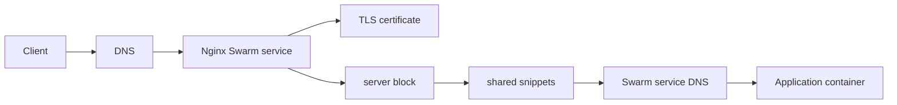

# Architecture

## Executive Summary

This repository is the static edge layer for the Docker Swarm platform. It replaces Traefik's dynamic label discovery with explicit Nginx configuration, versioned Docker config objects, and a predictable certificate lifecycle.

The design goal is operational control. Every public hostname is visible in `conf.d/10-routes.conf`, every shared proxy behavior lives in `snippets/`, and every certificate name is tied to `certbot-domains.txt`.

## Responsibilities

The edge owns:

- public HTTP and HTTPS entrypoints.
- HTTP to HTTPS redirects.
- ACME HTTP-01 challenge serving.
- TLS termination.
- reverse proxy routing to Swarm service DNS names.
- shared security headers.
- infrastructure basic auth.
- rate limiting.
- Nginx reloads after certificate renewal.

The edge does not own:

- application databases.
- application runtime secrets.
- container image builds.
- business application configuration.
- backups for application data.

## Request Flow

## File Model

| File | Purpose |
| --- | --- |
| `nginx.conf` | global Nginx process, events, HTTP defaults, config includes |
| `conf.d/00-http.conf` | port 80 redirect and ACME challenge behavior |
| `conf.d/10-routes.conf` | all HTTPS virtual hosts and upstream targets |
| `conf.d/bootstrap.conf` | temporary HTTP-only config used before certificates exist |
| `snippets/proxy-common.conf` | forwarded headers, HTTP version, proxy buffering defaults |
| `snippets/security-headers.conf` | normal application security headers |
| `snippets/security-headers-embed.conf` | adjusted headers for embedded Superset use cases |
| `snippets/ssl-params.conf` | TLS protocols, ciphers, session behavior |
| `snippets/ratelimit-infra.conf` | shared request and connection limiting |
| `snippets/auth-infra.conf` | basic auth for infrastructure routes |
| `certbot-domains.txt` | SAN certificate hostname source of truth |
| `deploy.sh` | deployment orchestrator and Docker config versioning |

## Docker Swarm Model

The stack runs two main services:

- `nginx`: public edge service bound to ports 80 and 443.
- `certbot`: renewal sidecar using the same certificate and webroot volumes.

Important persistent volumes:

- `nginx-letsencrypt`: certificate material.
- `nginx-certbot-webroot`: ACME HTTP-01 challenge files.
- `nginx-logs`: access and error logs.

The default network is still named `edge-net` to preserve compatibility with existing services. That is intentional. It avoids forcing every app stack to change during the proxy migration.

## Static Routing Choice

Traefik discovers routes dynamically from service labels. Nginx in this repo does the opposite: routes are declared centrally.

Benefits:

- one file shows every public hostname.
- route review is simple.
- no accidental exposure through a wrong label.
- Nginx behavior is predictable.
- debugging is direct because routes do not appear/disappear through Docker metadata.

Tradeoff:

- adding a route requires editing and redeploying the edge.
- there is no automatic discovery.

That tradeoff is acceptable for this infrastructure because the number of public services is limited and operational clarity matters more than automation.

## Future Evolution

This edge can evolve in two directions:

1. remain the stable Swarm edge while app stacks continue to run in Docker Swarm.
2. act as the conceptual bridge toward `k3s-application-platform`, where Nginx server blocks become Kubernetes Ingress objects.

