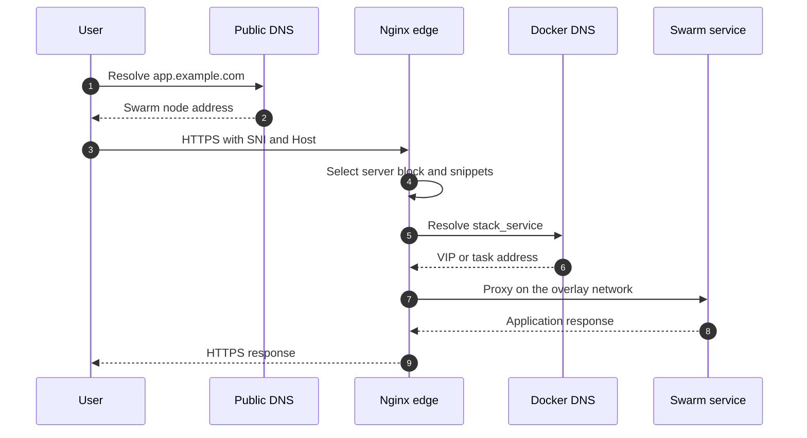
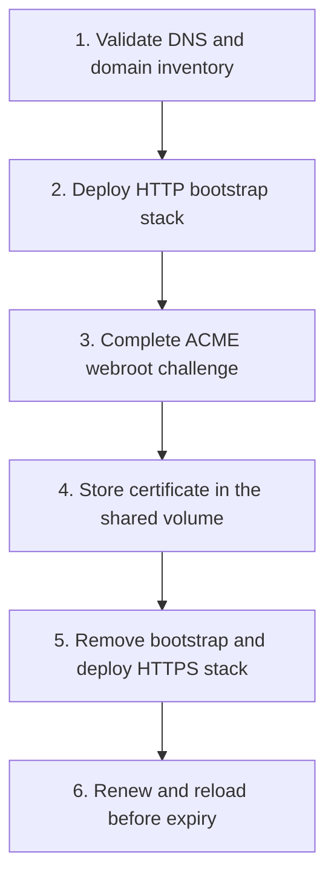
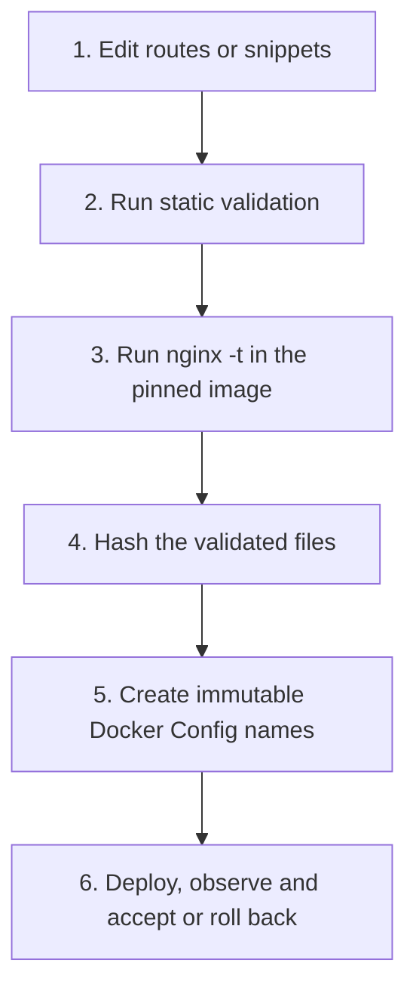

# Architecture diagrams

## Request path

```mermaid
sequenceDiagram
    autonumber
    participant U as User
    participant D as Public DNS
    participant N as Nginx edge
    participant R as Docker DNS
    participant A as Swarm service

    U->>D: Resolve app.example.com
    D-->>U: Swarm node address
    U->>N: HTTPS with SNI and Host
    N->>N: Select server block and snippets
    N->>R: Resolve stack_service
    R-->>N: VIP or task address
    N->>A: Proxy on the overlay network
    A-->>N: Application response
    N-->>U: HTTPS response
```

## First certificate lifecycle

```mermaid
flowchart TB
    A[1. Validate DNS and domain inventory]
    B[2. Deploy HTTP bootstrap stack]
    C[3. Complete ACME webroot challenge]
    D[4. Store certificate in the shared volume]
    E[5. Remove bootstrap and deploy HTTPS stack]
    F[6. Renew and reload before expiry]

    A --> B --> C --> D --> E --> F
```

## Configuration release

```mermaid
flowchart TB
    A[1. Edit routes or snippets]
    B[2. Run static validation]
    C[3. Run nginx -t in the pinned image]
    D[4. Hash the validated files]
    E[5. Create immutable Docker Config names]
    F[6. Deploy, observe and accept or roll back]

    A --> B --> C --> D --> E --> F
```

